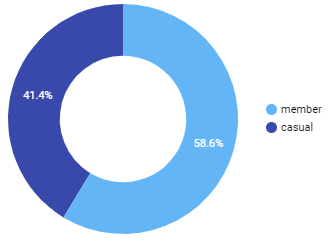
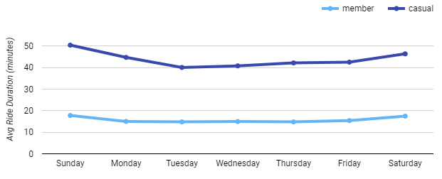
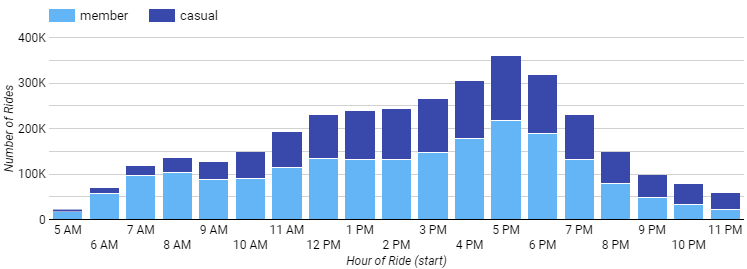

## Table of Contents

1. [Introduction](README.md#introduction)
2. [Business Objective](README.md#business-task)
3. [Data](README.md#data)
4. [Data Processing and Cleaning](README.md#processing-and-cleaning)
5. [Analysis and Visualization](README.md#analysis-and-viz)
6. [Conclusion and Recommendations](README.md#conclusions)

## Introduction

This project is part of the **Google Data Analytics Certification course capstone**. Focusing on the analysis of trip data from the Cyclistic bike share company.

The company provides two service models: individual passes known as "casual" riders and annual subscriptions referred to as "member" riders. Operating in Chicago with 6000 bicycles at 700 stations, the goal is to maximize annual memberships for future growth, ensuring financial sustainability and customer retention. Insights from the analysis can aid in developing effective marketing strategies to convert casual riders into annual members.

## Business Objective

Understand how annual members and casual riders differ in their usage of Cyclistic bikes.

> **Objective** : Clean, analyze, and visualize data to observe differences in how casual riders and annual members use bike rentals.

## Data

* **Data source** : Public data from Motivate International Inc. (Divvy Bicycle Sharing Service from Chicago) under this [license](https://www.divvybikes.com/data-license-agreement).
* [Cyclistic’s historical trip data](https://divvy-tripdata.s3.amazonaws.com/index.html) (2013 onwards) available in `.csv` format. 
* **Our date range** : May 2020 to April 2021 (608 MB data)
* The dataset has individual ride records consisting of ride start-end date & time, station information, bike type, rider type (casual/member).
* Data uploaded to Google Cloud Storage(GCS) in order to import the large files.

## Processing and Cleaning

* Data imported from GCS into **BigQuery** for manipulation and analysis using SQL.
* Visualizations to be developed in **Google Data Studio**.
* Datatypes made consistent and then consolidated into one view using [this query](https://github.com/shivamgarg444/Cyclistic-Case-Study/blob/main/uncleaned_compile.sql).
* To assist in analysis, 4 new columns were added (start point location, end point location, ride start day name and ride duration in seconds).
* `3,742,624` rows were returned but required cleaning.
* **Cleaning process** :
  * Missing start and end station names found using [this query](station_check.sql).
  * Other columns checked using [this query](columns_check.sql).
  * Negative and zero ride duration values found using [this query](duration_check.sql).
> Following the cleaning and consolidating data in one table, `3,476,354` rows were returned for proceeding to analysis. All of this was achieved using [this single master query](single_query.sql). `JOIN`, `WITH`, `UNION ALL`, `WHERE`, _subqueries_ and many other SQL functions were used here.

## Analysis and Viz

The final dataset of approximately 3.4 million ride records was analyzed, and visualizations were created in Google Data Studio to highlight trends in the usage by casual riders and annual members.  

### Total ride share

#### **Insights**
* 58.6% of total rides are taken by annual members(3.4 Mil).
* while 41.4% are taken by casual riders.
* Maximizing annual members is crucial for long-term business success.

### Weekly distribution of number of rides

#### **Insights**
* Clearly, Casual riders __peak__ throughout the __weekend__ as compared to that of annual members which remains relatively flat. 
* About __50% less__ casual riders use the rentals during weekdays as compared to weekends.  
* This indicates that casual riders use the bike rentals for leisure purposes and not for commuting.     

### Weekly distribution of average ride duration

#### **Insights**
* The average ride duration of casual members is  about __3 times__ that of annual members.
* The average ride duration both type of riders increase on weekends.
* Again, this indicates that casual riders use the bike rentals for leisure purposes.  

### Ride duration vs Ride distance

#### **Insights**
* The plots clearly show the contrast between average ride duration and average ride distance  for both user types. 
* While both user types ride a __similar average distance__, casual riders ride for __3x longer duration__ as compared to annual members.     

### Hourly distribution of number of rides

#### **Insights**
* The proportion of casual riders increases in the non-commuting hours i.e. in forenoon hours and after 8pm from __18%__ of total riders to __50%__ of total riders.
* Annual members take the major chunk of the rides during peak-travel hours in the morning and evening to upto __82%__ of total riders. 
* Again, this indicates that casual riders use the bike rentals for leisure purposes while annual members use it for commuting.  

### Monthly distribution of number of rides - Seasonality 

#### **Insights**
* The proportion of casual riders __falls__ drastically during winter months(Dec-Feb) to only about __20%__ of total riders.
* The proportion of casual riders goes __maximum__ in the months of June, July, August and September to upto __40%__ of total riders.  

## Conclusion and Recommendations

* A common observation is that __casual riders__ are using the bike rentals for __leisure and tourism__ purposes while __annual members__ use it predominantly for __commuting__ purposes.
* Implement targeted on-ground marketing at leisure locations.  
* Offer discount campaigns for casual riders on weekdays to encourage commuting. 
* Utilize push notifications to attract casual riders during off-peak hours.
* Consider campaigns during winter months, possibly tied to holidays or Christmas, to boost ridership during that period. 
